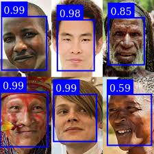

# face-detection-node

[![build status][ci-image]][ci-url]
[![Test coverage][codecov-image]][codecov-url]

Face detection with a few options. Based off [face-api](https://github.com/vladmandic/face-api).

Take a look at the [examples](./examples) folder.

1. Clone the project
2. `npm i` to install deps.

Recommendation: run the examples first, using `ts-node example1.ts` or `ts-node example2.ts`.

## Original Image

## Mask (hides face)

The image is stored to the following output `./out/3_mask/096_077_057_testThreeFaces.jpg`

## Score (confidence)

The image is stored to the following output `./out/3_scored/096_077_057_testThreeFaces.jpg`

## Many faces

## To-Do / Try

- [Try this project](https://github.com/vladmandic/human), that could replace `face-api`
- Try to use only tensorflow

## License

- This code is under [MIT](./LICENSE)

All images used for training are in the public domain.

[ci-image]: https://github.com/santimirandarp/face-detection-node/workflows/Linters/badge.svg?branch=main
[ci-url]: https://github.com/santimirandarp/face-detection-node/actions?query=workflow%3A%22Node.js+CI%22
[codecov-image]: https://img.shields.io/codecov/c/github/santimirandarp/face-detection-node.svg
[codecov-url]: https://codecov.io/gh/santimirandarp/face-detection-node
